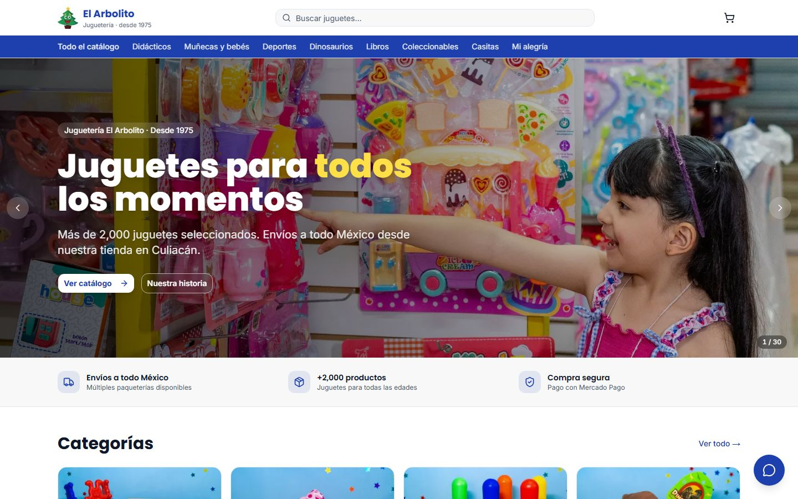
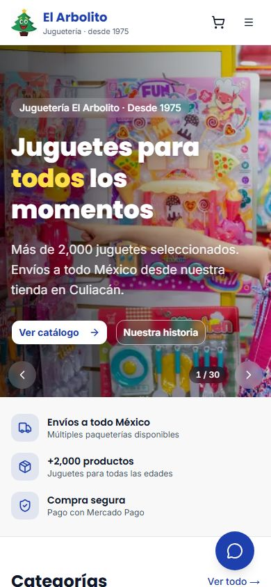

# Juguetería El Arbolito

Tienda en línea con panel de administración para una juguetería real de Culiacán, Sinaloa (abierta desde 1975). Vende con Mercado Pago y mantiene el inventario al día con el punto de venta de la tienda física.

**Sitio en vivo:** https://jugueteria-el-arbolito.vercel.app





## Qué hace

**Tienda para clientes**
- Catálogo con categorías, búsqueda, filtros por precio y orden.
- Página de producto, carrito y pago con Mercado Pago.
- Seguimiento de pedido por número.
- Páginas de envíos, políticas, preguntas frecuentes y contacto.
- Asistente de chat con IA que ayuda a encontrar juguetes.

**Panel de administración**
- Roles `staff`, `admin` y `superadmin` con permisos por ruta.
- Gestión de productos (foto, categoría, precio y publicación), pedidos y usuarios.
- Los productos nuevos que llegan del punto de venta quedan sin publicar hasta que alguien del equipo los revisa.

**Sincronización con la tienda física**
- Un programa en Python lee el catálogo de Eleventa (el punto de venta de la tienda) en solo lectura y manda el inventario completo a Supabase cada 5 minutos.
- Si una lectura viene vacía o incompleta, no se da de baja ningún producto y queda registrado en el log.
- Incluye instalador para Windows pensado para la dueña de la tienda.

## Tecnologías

- Next.js 15 (App Router), React 19, TypeScript y Tailwind CSS
- Supabase (Postgres, Auth, Storage y Row Level Security), con migraciones en `supabase/migrations/`
- Mercado Pago (preferencias de pago y webhook con firma verificada)
- OpenRouter, Groq y Gemini para el chat
- Python con `fdb` y PyInstaller para el agente de sincronización
- Vercel para el despliegue

## Cómo correrlo en local

Necesitas Node.js 20 o superior y un proyecto de Supabase.

```bash
cd web
cp .env.example .env.local
npm install
npm run dev
```

Se abre en http://localhost:3000. Las variables de `web/.env.example` son:

- `NEXT_PUBLIC_SUPABASE_URL`, `NEXT_PUBLIC_SUPABASE_ANON_KEY` y `NEXT_PUBLIC_SITE_URL`
- `SUPABASE_SERVICE_ROLE_KEY`
- `MERCADOPAGO_ACCESS_TOKEN` y `MERCADOPAGO_WEBHOOK_SECRET`
- `CRON_SECRET`
- `OPENROUTER_API_KEY`, `GROQ_API_KEY` y `GEMINI_API_KEY` (opcionales, para el chat)

Antes de arrancar hay que aplicar las migraciones de `supabase/migrations/` en orden (los pasos están en `supabase/README.md`).

Para el agente de sincronización, en Windows y con Eleventa instalado:

```bash
cd agent
pip install -r requirements.txt
cp .env.example .env
python -m unittest discover -s tests
```

El empaquetado a `.exe` y la instalación en la tienda están en `agent/README.md`.

## Estructura

```
web/        Next.js: tienda, panel de administración y rutas de API
supabase/   migraciones, esquema y funciones SQL
agent/      agente de sincronización con Eleventa, instalador y pruebas
scripts/    importación inicial de inventario y respaldo
docs/       documentos de diseño (arquitectura, base de datos, pagos, envíos, chatbot)
```

## Mi parte

Proyecto freelance que hice solo: requisitos con la dueña, diseño de la base de datos, la tienda, el panel, los pagos, el chat, el agente de sincronización y el despliegue.

Autor: [Hermann Pauwells Rivera](https://hermannpr.github.io/)

## Licencia

[MIT](LICENSE). La marca, las fotos y el contenido de la tienda pertenecen a Juguetería El Arbolito.
