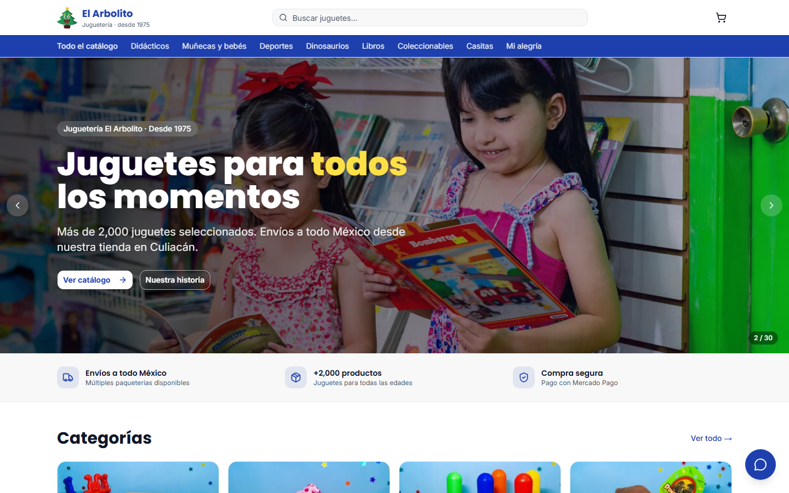
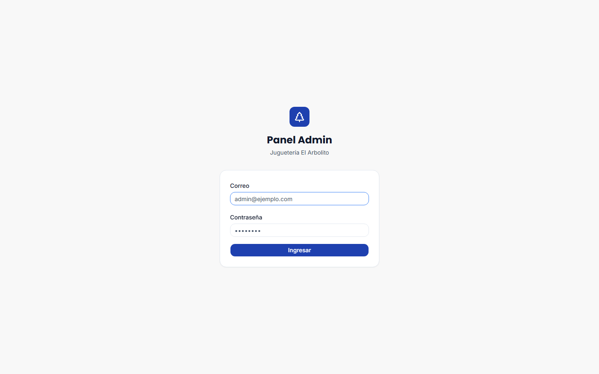
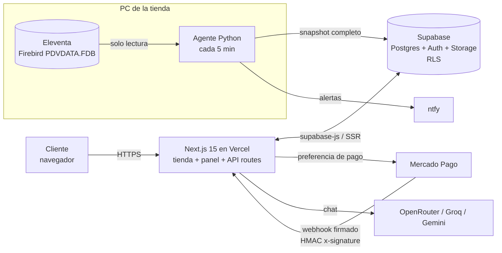

# Juguetería El Arbolito: tienda en línea

> **ES:** Tienda en línea y panel de administración en producción para una juguetería real de Culiacán (desde 1975), con pagos de Mercado Pago y sincronización de inventario con su punto de venta.
> **EN:** Production online store and admin panel for a real toy store in Culiacán, Mexico (since 1975), with Mercado Pago payments and inventory sync from the in-store point of sale.

<p>


</p>

**Sitio en vivo:** [jugueteria-el-arbolito.vercel.app](https://jugueteria-el-arbolito.vercel.app)
**Autor:** [Hermann Pauwells Rivera](https://hermannpr.github.io/) (desarrollador full-stack freelance, junio 2026 a la fecha)



## El problema

La juguetería vende en mostrador con **Eleventa** (punto de venta sobre Firebird) y no tenía tienda en línea. El reto no era solo hacer un catálogo bonito: el inventario vive en la PC de la tienda, la dueña no es técnica y una venta en línea no puede vender una pieza que ya se vendió en mostrador.

## Qué hace

**Tienda (clientes)**
- Catálogo con categorías, búsqueda, filtros por precio y orden.
- Página de producto, carrito persistente y checkout con **Mercado Pago**.
- Seguimiento de pedido por número (`/pedido/[order_number]`).
- Páginas de envíos, políticas, FAQ, contacto y "Nosotros"; `sitemap.xml` y `robots.txt` generados.
- Asistente de chat con LLM (OpenRouter con modelos de respaldo, más Groq/Gemini opcionales) y límite de uso por cliente en la base de datos.

**Panel de administración**
- Roles `staff`, `admin` y `superadmin` con permisos por ruta (middleware + `role_rank()` en SQL).
- Gestión de productos: foto, categoría, precio manual y publicación. Los productos nuevos que llegan del punto de venta entran **sin publicar** hasta que el equipo los revisa.
- Gestión de pedidos y estado, usuarios y una vista de sistema con el estado de la sincronización.

**Agente de sincronización (PC de la tienda)**
- Programa en Python que lee el catálogo de Eleventa **en solo lectura** y manda una foto completa a Supabase cada 5 minutos.
- Supabase aplica altas, bajas, precios y stock en una sola transacción (`sync_eleventa_snapshot`). Stock web = existencia en tienda menos ventas web pagadas que aún no se capturan en Eleventa.
- Una lectura vacía o incompleta nunca da de baja productos; queda registrada en `sync_log`.
- Reintentos con backoff, timeouts de Firebird, alertas por ntfy y un instalador `.exe` de doble clic para la dueña (sin llaves dentro del ejecutable).

<p>

&nbsp;

</p>

## Arquitectura



Decisiones clave (documentadas en [`docs/`](docs/)):
- **Webhook verificado:** `/api/webhooks/mercadopago` valida la firma `x-signature` con HMAC-SHA256 y `timingSafeEqual`; sin secreto configurado responde 503 en lugar de aceptar pagos sin verificar.
- **La llave `service_role` solo vive en el servidor** (checkout, webhook y cron). El navegador usa la llave pública con Row Level Security.
- **Snapshot en lugar de cola offline:** cada ciclo manda el catálogo completo, así que si se cae internet el siguiente ciclo deja todo al día.
- **Cron de keepalive** en Vercel (`/api/cron/keepalive`, protegido con `CRON_SECRET`) para que el proyecto de Supabase no se pause.

## Stack

| Capa | Tecnología |
|---|---|
| Frontend y API | Next.js 15 (App Router), React 19, TypeScript, Tailwind CSS, shadcn/ui, lucide-react |
| Datos y auth | Supabase (Postgres, Auth, Storage, RLS, funciones SQL), 6 migraciones versionadas |
| Pagos | Mercado Pago SDK (preferencias + webhook firmado) |
| IA | OpenRouter con lista de modelos de respaldo; Groq y Gemini opcionales |
| Sincronización | Python, `fdb` (Firebird), PyInstaller, pruebas con unittest |
| Despliegue | Vercel (web + cron), ejecutable Windows para la tienda |

## Correr en local

Requisitos: Node.js 20+, un proyecto de Supabase.

```bash
cd web
cp .env.example .env.local   # llenar las llaves de Supabase; Mercado Pago vacío = modo simulación
npm install
npm run dev                  # http://localhost:3000
```

Base de datos: aplicar las migraciones de [`supabase/migrations/`](supabase/migrations/) en orden (ver [`supabase/README.md`](supabase/README.md)).

Agente de sincronización (Windows, con Eleventa instalado):

```bash
cd agent
pip install -r requirements.txt
cp .env.example .env         # llaves de Supabase y ruta a PDVDATA.FDB
python -m unittest discover -s tests   # pruebas del ciclo de sync, reintentos y alertas
```

El empaquetado a `.exe` y la instalación en la tienda están en [`agent/README.md`](agent/README.md).

## Estructura

```
web/                 Next.js: tienda (app/(store)), panel (app/admin), API (checkout, webhook, chat, cron)
  src/lib/           clientes de Supabase (navegador, servidor, admin), roles, auth
supabase/migrations/ esquema, RLS y funciones, roles y auditoría, sync de Eleventa, hardening, rate limit del chat
agent/               agente de sincronización Eleventa -> Supabase, instalador y pruebas
scripts/             importación inicial de inventario y respaldo de la base
docs/                17 documentos de diseño: arquitectura, base de datos, pagos, envíos, chatbot, decisiones
```

## Mi rol

Proyecto freelance individual: levantamiento de requisitos con la dueña, diseño de la base de datos y la arquitectura, desarrollo de la tienda, el panel, la integración de pagos, el chatbot y el agente de sincronización, y despliegue en Vercel.

## Estado

- En producción: tienda, checkout con Mercado Pago, panel de administración y chatbot.
- En curso: carga del catálogo de 2,395 productos exportado de Eleventa (se publican conforme el equipo agrega foto y categoría) y puesta en marcha del agente de sincronización en la PC de la tienda.
- Documentación de diseño completa en [`docs/00_README_PRINCIPAL.md`](docs/00_README_PRINCIPAL.md).

## Licencia

[MIT](LICENSE). Marca, fotos y contenido de la tienda pertenecen a Juguetería El Arbolito.
